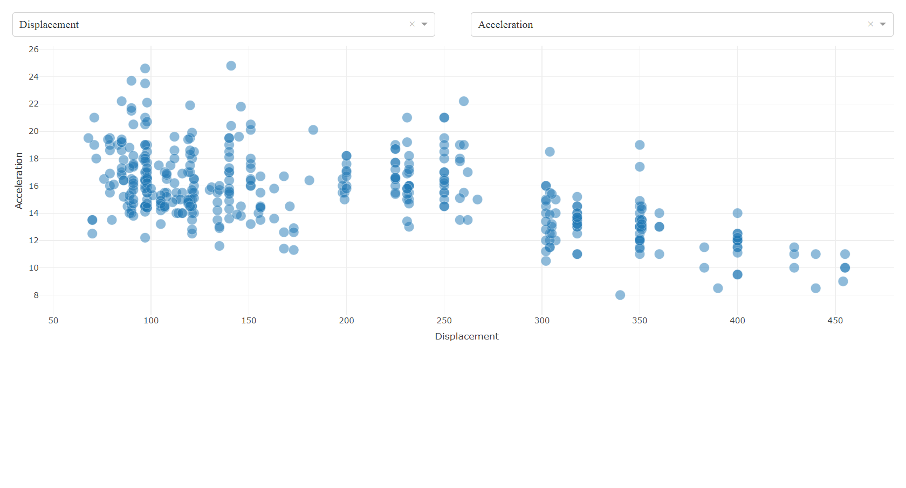
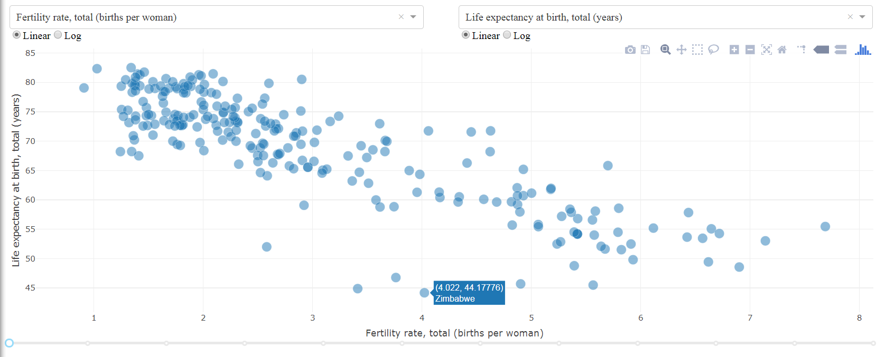

## 1. [Dash Bacis Layout](Dash%20App%20Layout/Readme.md)
## 2. Dash Components:
* dash_html_components
Html components describe the layout of the page
* dash_core_components
Dcc components descirbe the individual graphs themselves

#### 2.1 HTML Component
* An html Div element is a division 
  * Section or block of the web app (dashboard)
* CSS allows for styling HTML elements
  * Fonts, Colors, Boarders, ets
  * Dash uses dictonaries to pass in CSS style calls     
  
[Eg](Code/HTMLComponents.py)

#### 2.2 [Dash Core Components](https://dash.plot.ly/dash-core-components)
Dash Core Components are most abstract (higher level) calls that allow you to quickly insert common components into your dash board.     
[Eg](Code/CoreComponents.py)

#### 2.3 Markdown with Dash
Dashboards can also display markdown text which allows for links, italics, bold text, bullet lists, and more.      
[Eg](Code/markdown.py)

## 3. Callback
Steps to create a callback for interactions
* Create a function to return some desired output
* Decorate that function with an **@app.callback** decorator
  * Set an Output to a component id
  * Set an Input to a component id
* Connect the desired properties

Basic callback:
[Eg. 1](Code/callback1.py), [Eg. 2](Code/callback2.py)

Multiple input:     

[Eg. 3](Code/callback3.py)            |  [Eg. 4](Code/callback4.py)
:-------------------------:|:-------------------------:
   |   

Multiple output:
[Eg. 5](Code/callback5.py), [Eg. 6](Code/callback6.py), [Eg. 7](Code/callback7.py)

Callback with state:
[Eg. 1](Code/callback_state_01.py), [Eg. 2](Code/callback_state_02.py)

## 4. Interactive
**Hover data** [Eg. 1](Code/hover1.py), [Eg. 2](Code/hover2.py)       
**Click data** [Eg.](Code/ClickData.py)
**Update Graph**

