### **Scatter plot**:  
Depending on the trend of the scatter points, we could interpret a correlation.    

[Eg. 1](Code/Plotly_Scatter_eg_1.ipynb)           |  [Eg. 2](Code/Plotly_Scatter_eg_2.ipynb) 
:-------------------------:|:-------------------------:
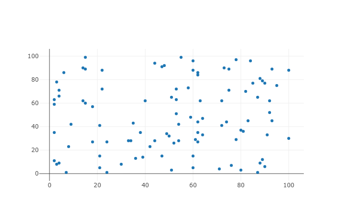   |   

[Eg. 3](Code/Plotly_Scatter_eg_3.ipynb)            |  
:-------------------------:|
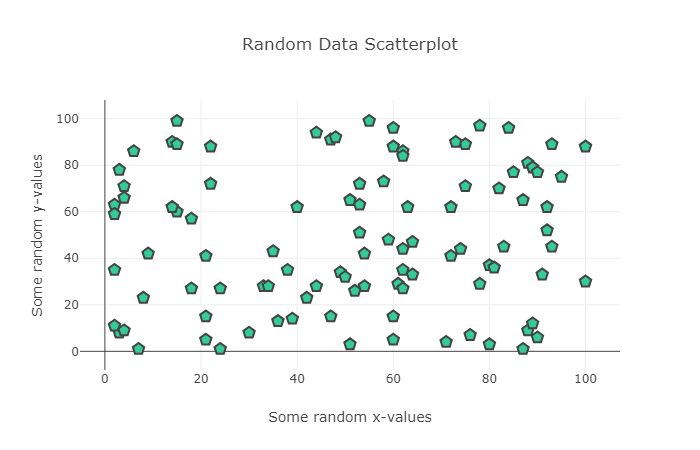   |  

### **Line chart**: 
Often used to visualize a trend in data over intervals of time - known as a time series  

[Eg. 1](Code/Plotly_Scatter_eg_1.ipynb)            |  
:-------------------------:|
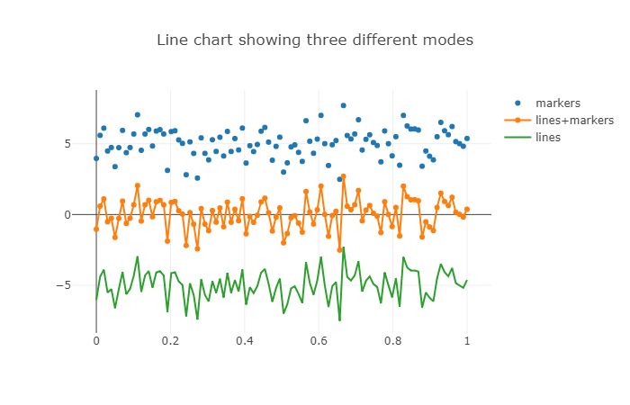   | 

[Eg. 2](Code/Line_Chart_eg_2.ipynb)           |  [Eg. 3 (read raw)](Code/Line_Chart_eg_3.ipynb)  
:-------------------------:|:-------------------------:
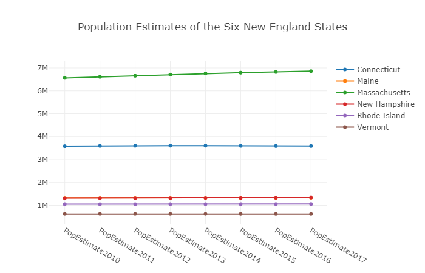   |  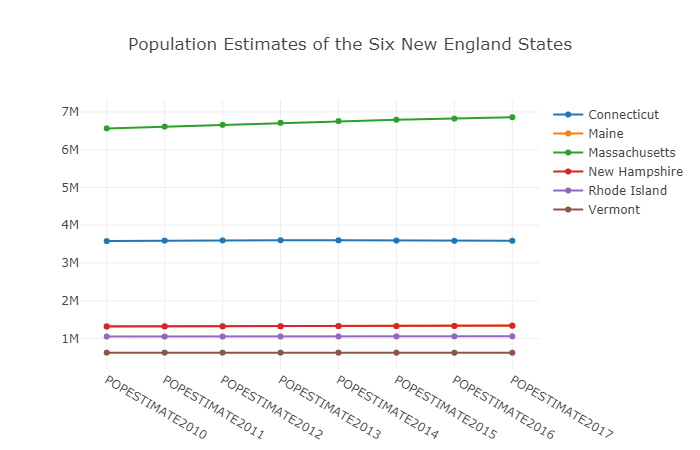 

[Eg. 4](Code/Line_Chart_eg_4.ipynb)           |  [Eg. 5 (define var)](Code/Line_Chart_eg_5.ipynb)  
:-------------------------:|:-------------------------:
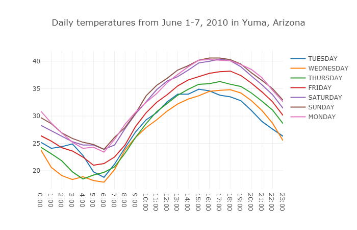   |   

### **Bar chart**: 
Present categorical data with rectangular bars with heights (or lengths) proportional to the values that they represent.  

[Eg. 1](Code/Bar_Chart_eg_1.ipynb)           |  [Eg. 2](Code/Bar_Chart_eg_2.ipynb)  
:-------------------------:|:-------------------------:
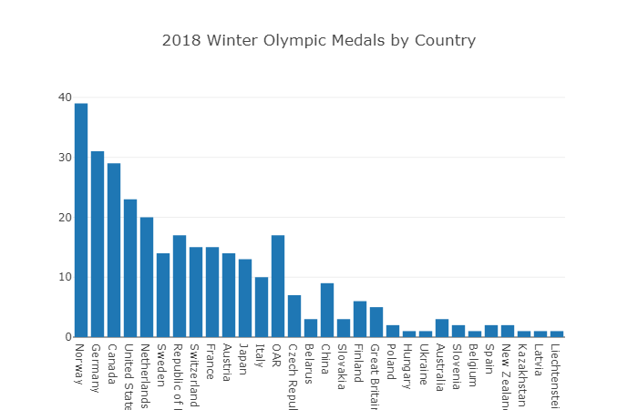   |  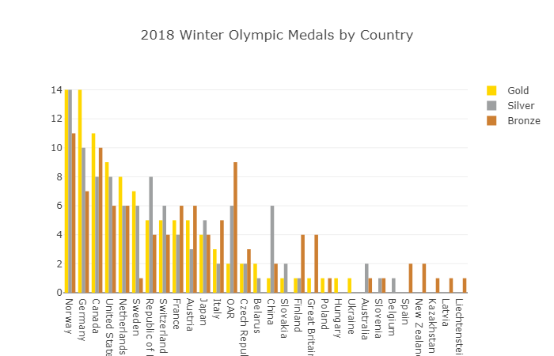 

[Eg. 3](Code/Bar_Chart_eg_3.ipynb)            |  
:-------------------------:|
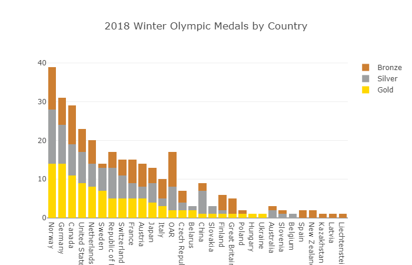   | 

[Eg. 4](Code/Bar_Chart_eg_4.ipynb)           |  [Eg. 5 (horizontal)](Code/Bar_Chart_eg_5.ipynb)  
:-------------------------:|:-------------------------:
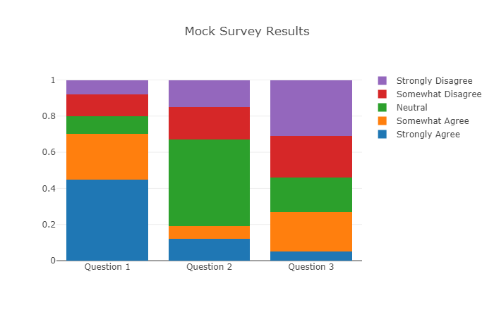   |  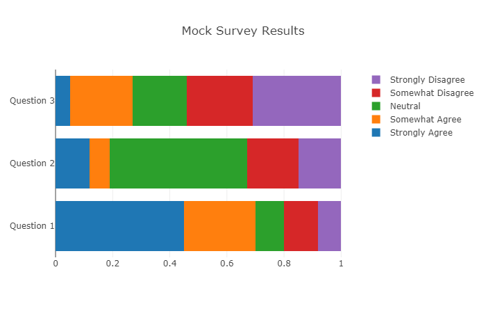 

### **Bubble chart**:
Bubble charts are very similar to scatter plots, except we now convey a third variabls's information through the size of the markers.

[Eg. 1](Code/Bubble_Chart_eg_1.ipynb)           |  [Eg. 2](Code/Bubble_Chart_eg_2.ipynb)  
:-------------------------:|:-------------------------:
   |  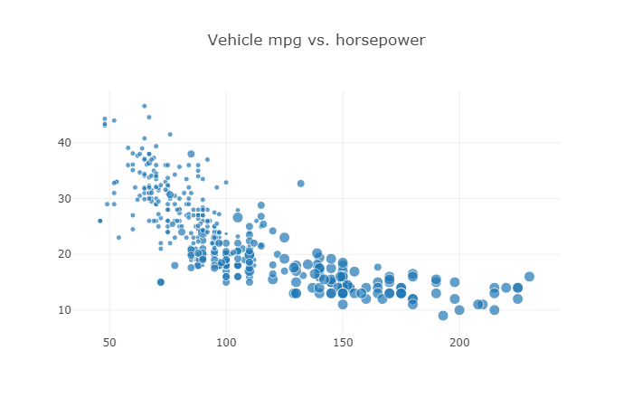 

[Eg. 3](Code/Bubble_Chart_eg_3.ipynb)            |  
:-------------------------:|
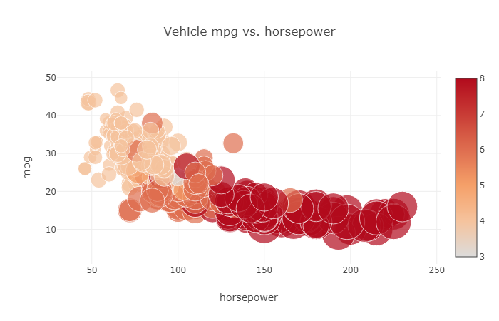   | 

### Box Plot
Box ploy visualize the variation of a feature by depicting the continous numerical data through quartiles.

[Eg. 1](Code/Box_Chart_eg_1.ipynb)           |  [Eg. 2](Code/Box_Chart_eg_2.ipynb)  
:-------------------------:|:-------------------------:
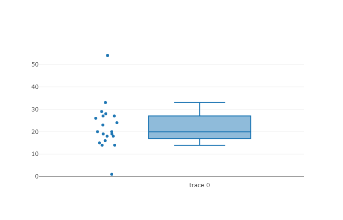   |  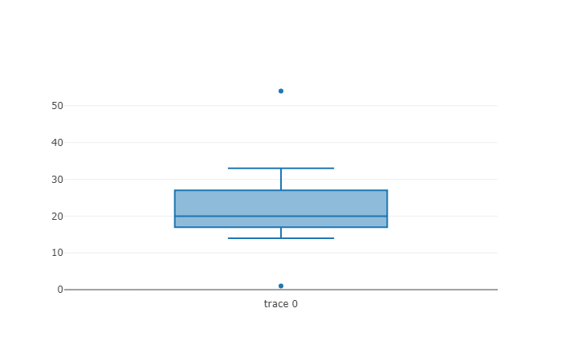 

[Eg. 3](Code/Box_Chart_eg_3.ipynb)            |  
:-------------------------:|
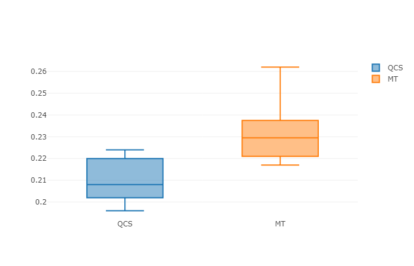   | 

### Histogram:
A histogram displays an accurate representation og the overall distribution of a continuous feature.

[Eg. 1](Code/Histogram_Chart_eg_1.ipynb)           |  [Eg. 2](Code/Histogram_Chart_eg_2.ipynb)  
:-------------------------:|:-------------------------:
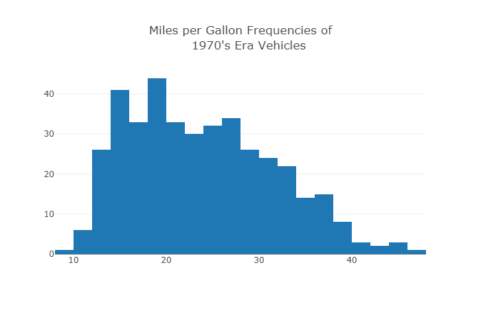   |  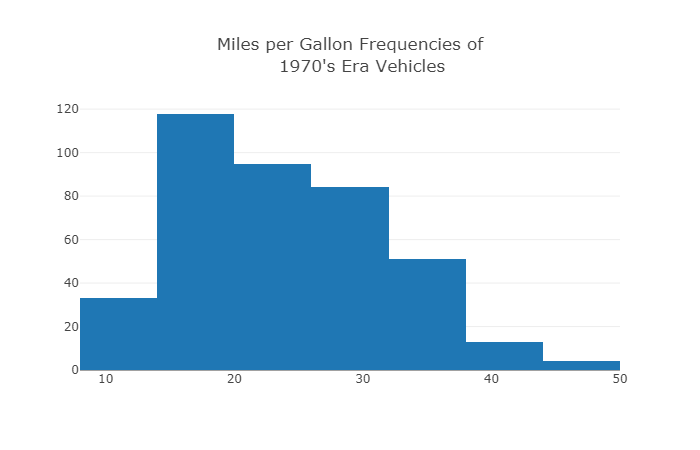 

[Eg. 3](Code/Histogram_Chart_eg_3.ipynb)           |  [Eg. 4](Code/Histogram_Chart_eg_4.ipynb)  
:-------------------------:|:-------------------------:
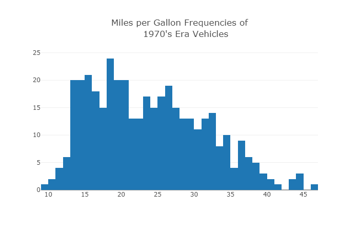   |  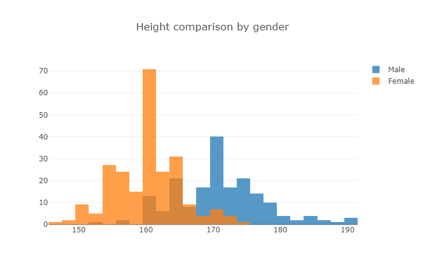 

### Distribution plot
Histogram + rug plot + kernel density estimate

[Eg. 1](Code/Dist_Chart_eg_1.ipynb)           |  [Eg. 2](Code/Dist_Chart_eg_2.ipynb)  
:-------------------------:|:-------------------------:
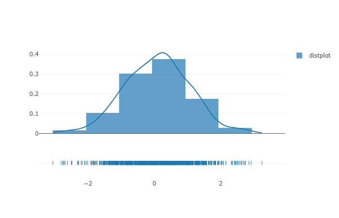   |  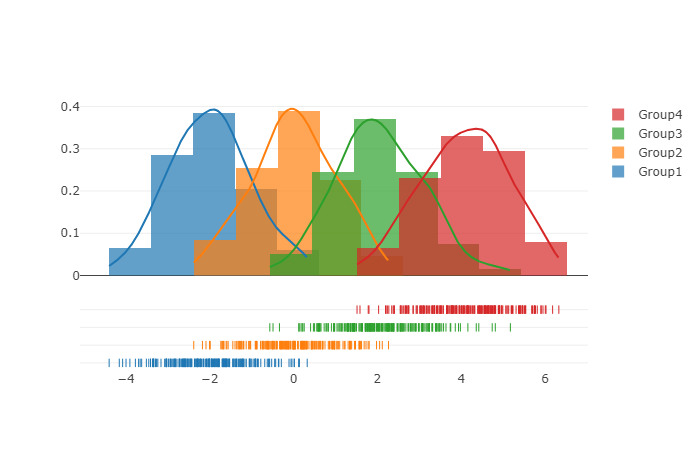 

[Eg. 3](Code/Dist_Chart_eg_3.ipynb)            |  
:-------------------------:|
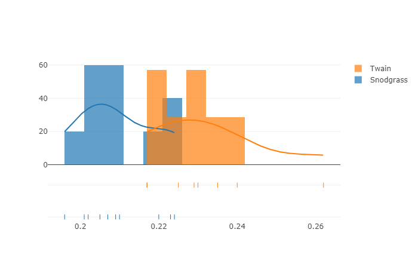   | 
