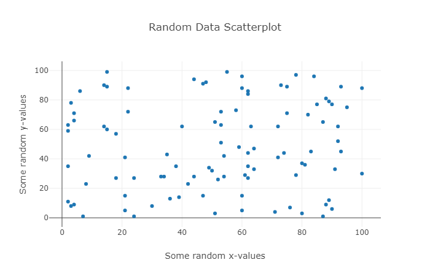

### **Scatter plot**:  
Depending on the trend of the scatter points, we could interpret a correlation.    

[Eg. 1](Code/Plotly_Scatter_eg_1.ipynb)           |  [Eg. 2](Code/Plotly_Scatter_eg_2.ipynb) 
:-------------------------:|:-------------------------:
   |   

[Eg. 3](Code/Plotly_Scatter_eg_3.ipynb)            |  
:-------------------------:|
   |  

### **Line chart**: 
Often used to visualize a trend in data over intervals of time - known as a time series    

### **Bar chart**: 
Present categorical data with rectangular bars with heights (or lengths) proportional to the values that they represent.    
